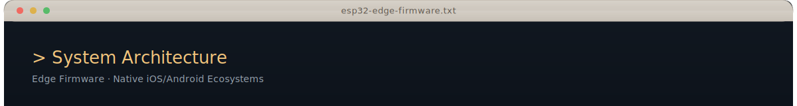
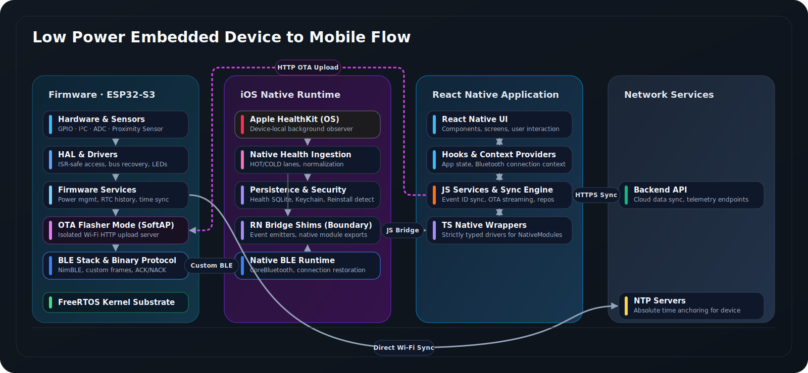
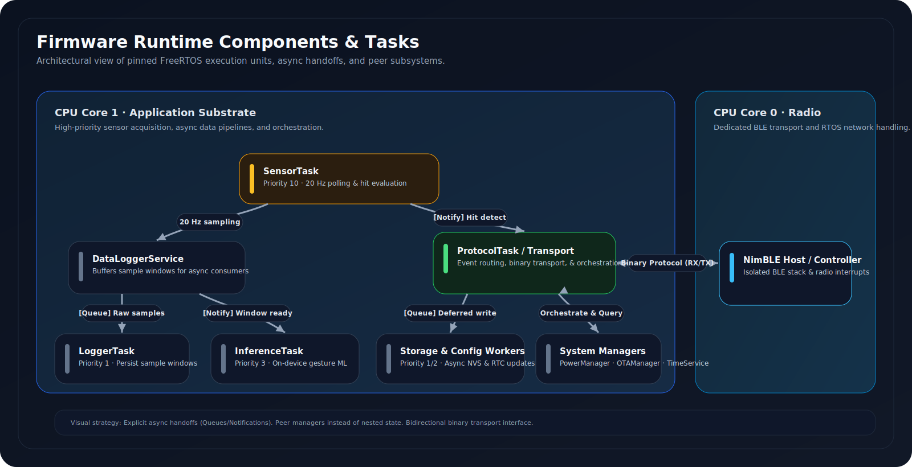

  
  

  

 

## Overview

This document details the architecture of a high-reliability connected device ecosystem (ESP32-S3 embedded firmware + iOS companion app). 

We designed this system for the real world, not the happy path. It is engineered to handle:
*   Intermittent connectivity and long unattended offline periods.
*   Strict power budgets.
*   Hostile mobile OS lifecycle constraints.

Our architecture prioritizes **data integrity**, **fault recovery**, and **deterministic real-time behavior**. The system remains correct, observable, and recoverable under all operating conditions.

 

## Technology Stack

<table>
  <tr>
    <td><strong>MCU</strong></td>
    <td></td>
  </tr>
  <tr>
    <td><strong>RTOS</strong></td>
    <td></td>
  </tr>
  <tr>
    <td><strong>Language</strong></td>
    <td> </td>
  </tr>
  <tr>
    <td><strong>Build</strong></td>
    <td></td>
  </tr>
  <tr>
    <td><strong>BLE Stack</strong></td>
    <td></td>
  </tr>
  <tr>
    <td><strong>iOS Companion</strong></td>
    <td> </td>
  </tr>
  <tr>
    <td><strong>Storage</strong></td>
    <td>  </td>
  </tr>
  <tr>
    <td><strong>Connectivity</strong></td>
    <td> </td>
  </tr>
</table>

 
## Engineering Principles

### 1. Isolate time-critical paths from blocking work
Real-time sensing, protocol handling, and storage are competing workloads. We separate them. High-frequency sensor processing lives on dedicated FreeRTOS tasks. It never waits for flash memory, BLE, or ML work. On mobile, data ingestion uses lane-specific execution paths with explicit transaction guarantees.

> **Goal:** Preserve deterministic behavior when slow I/O, radio, and backfills compete for resources.

### 2. Treat recovery as a first-class behavior
Partial failures will happen. We expect interrupted writes, corrupted state, and broken BLE bonds. Recovery paths are treated as primary operating modes. Firmware rolls back bad updates and recovers from boot loops. The mobile app detects reinstalls, clears stale secure data, and re-seeds recovery markers.

> **Goal:** A reliable system is not one that never fails. It is one that fails into a bounded, recoverable state.

### 3. Tier persistence by survivability and latency
State is stored based on the failures it must survive. Volatile continuity, durable history, secure identity, and app data do not mix. We explicitly divide them across RTC memory, NVS, SPIFFS, iOS Keychain, and SQLite.

> **Goal:** Storage is not a single bucket. It is a core part of the system's failure model.

### 4. Handle time and identity as distributed systems problems
Deep sleep, offline modes, and app reinstalls break naive clock assumptions. We reconstruct timeline continuity from a persistent uptime clock, then later anchor it to wall-clock time upon reconnection. BLE identity relies on robust bonding and recovery flows.

> **Goal:** Prove that data means the same thing after sleep, disconnect, and reconnection.

### 5. Enforce explicit, replay-tolerant protocol boundaries
The app-device link is an unreliable transport. Messages are strictly framed, typed, checksummed, sequenced, and acknowledged. This guarantees correctness despite retries, partial deliveries, or transient desynchronization.

> **Goal:** Explicit protocol design keeps the system predictable under noisy real-world conditions.

---

  <h2>Deep Dive: Technical Documentation</h2>
  
For a granular analysis of the underlying implementation, refer to the domain-specific documentation below:

| Document | Focus Area |
| :--- | :--- |
| [**Binary BLE Protocol**](ble-protocol.md) | Frame formats, CRC16 algorithms, and MSG_TYPE definitions. |
| [**OTA & Recovery**](ota-recovery.md) | Dual-bank partitioning, Flasher Mode (SoftAP), and rollback logic. |
| [**Task Model**](task-model.md) | FreeRTOS task priorities, core-pinning, and queue management. |
| [**Power State Machine**](power-state-machine.md) | Deep sleep cycles, wake-up sources, and battery monitoring. |
| [**Storage Integrity**](storage-integrity.md) | RTC Ring Buffers, NVS wear-leveling, and CRC32 verification. |
| [**Calibration & ML**](calibration-sensing-ml.md) | Sensor signal processing, adaptive thresholds, and gesture inference. |
| [**Failure Modes**](failure-modes.md) | A catalog of handled edge cases and system recovery strategies. |

 

## Layering and Ownership

| Subsystem | Firmware Responsibility | iOS App Responsibility | Key Interfaces |
| :--- | :--- | :--- | :--- |
| **HAL** | Hardware I/O, ISR-safe access, LED, flash management. | - | GPIO, I2C, ADC, FastLED |
| **BLE Protocol** | NimBLE stack, custom binary frames, ACK/NACK. | CoreBluetooth management, state restoration, JS Bridge. | NimBLE, CoreBluetooth, Binary |
| **Sensing** | 20Hz sensor polling, detection state machine, thresholds. | - | Proximity Sensor (I2C), GPIO |
| **Persistence** | RTC ring buffer, NVS backup, event ID synchronization. | SQLite DB storage, cursor state, detection processing. | RTC, NVS, SQLite, AsyncStorage |
| **Power Mgmt** | Power state machine, deep sleep prep, wake sources. | - | `esp_sleep`, `esp_pm`, ADC |
| **OTA & Recovery** | Dual-bank OTA, self-test, rollback, Flasher Mode. | Chunked HTTP upload, binary file reading, verification. | Wi-Fi (HTTP), BLE (Trigger) |
| **Time Sync** | NTP client, "One-Shot" Wi-Fi policy, system clock. | Timezone management, sync anchor, timestamp backfill. | NTP, MSG_TIME_SYNC |
| **Intelligence** | Raw sample logging (SPIFFS), gesture inference. | - | SPIFFS, NVS |

 

## Why This Architecture is Non-Trivial

*   **Real-time vs. Blocking Contention:** Blocking I/O (like flash writes) cannot starve the BLE radio or the 20Hz sensor loop. We use a multi-task FreeRTOS design with pinned tasks and async workers. This guarantees precise event detection and stable BLE connections under heavy load.
*   **Offline Time Reconstruction:** Devices spend most of their life offline in deep sleep, lacking a wall-clock. We maintain a persistent uptime clock in RTC memory. Upon reconnection, a "time-sync anchor" backfills precise absolute timestamps for all offline events.
*   **iOS Platform Lifecycle Correctness:** iOS imposes strict background execution rules. We handle CoreBluetooth state restoration to survive app crashes. We register HealthKit observers before app launch completes. Native pre-initialization detects reinstalls to prevent Keychain-induced failures.

 

## Runtime Model

### Firmware Concurrency (ESP32-S3)
Responsibilities are distributed across dedicated FreeRTOS tasks pinned to specific CPU cores. This manages timing guarantees and isolates blocking operations from real-time paths.

  

 

### Mobile App Concurrency
The mobile app isolates expensive work from the main thread using Apple's native frameworks. 
*   **CoreBluetooth:** Delegate methods execute on the main thread for UI responsiveness. 
*   **SQLite Access:** Database interactions are strictly serialized through a dedicated, high-priority `DispatchQueue` to guarantee transactional integrity.

 

## Critical System Flows

### 1. Firmware Boot and Initialization
Designed for rapid startup and robust self-healing.

1.  **Power-On:** ESP32-S3 powers up. First action: crash recovery check.
2.  **Crash Loop Detection:** An RTC counter tracks watchdog resets. Three consecutive resets trigger an NVS partition erase to clear corruption, followed by a clean reboot.
3.  **Flasher Mode:** Boot sequence checks RTC flags. If triggered, the device bypasses the main app and boots into an isolated "Flasher Mode" for out-of-band recovery.
4.  **Hardware Validation:** HAL initializes. If a new OTA update is pending, `performSelfTest()` runs. Failure triggers an immediate rollback.
5.  **Task Launch:** Core services initialize. The high-priority `SensorTask` launches on Core 1.
> **Architectural Guarantee:** The device is unbrickable. It autonomously recovers from corrupted storage, bad updates, and bus lockups.

### 2. Sensing, Event Detection, and Persistence
Ensures zero data loss and accurate detection, even when offline.

1.  **High-Priority Polling:** `SensorTask` polls proximity data every 50ms. High priority prevents starvation.
2.  **Adaptive Validation:** Raw data passes through adaptive thresholds, a "stuck-detection watchdog", and environmental backoff to reject noise (e.g., glass reflections).
3.  **Durable Offline Logging:** Valid detections write immediately to a CRC-protected ring buffer in low-power RTC memory.
4.  **Asynchronous Backup:** A low-priority `StorageWorker` periodically flushes the RTC buffer to NVS flash. This write is explicitly deferred if BLE is active.
> **Architectural Guarantee:** Zero data loss while offline. Separation of detection and I/O ensures accuracy and BLE stability.

### 3. Over-The-Air (OTA) Updates & Rollback
A resilient, Wi-Fi-based firmware update process.

1.  **Trigger:** App sends a BLE command. Device sets an RTC flag and reboots.
2.  **Isolated Runtime:** Device boots into `FlasherService`. Sensors and BLE are powered down to maximize stability and RAM.
3.  **Direct Upload:** Device creates a Wi-Fi SoftAP. App uploads firmware in 4KB HTTP chunks. Erase and network phases are decoupled.
4.  **Commit & Test:** Firmware commits and the device reboots. The new firmware immediately runs `performSelfTest()`.
5.  **Automatic Rollback:** If the test fails, the bootloader marks the update invalid and reboots into the previous known-good partition.
> **Architectural Guarantee:** OTA is fail-safe. Corrupt transfers, power loss, or buggy images will not brick the hardware.

 

  

