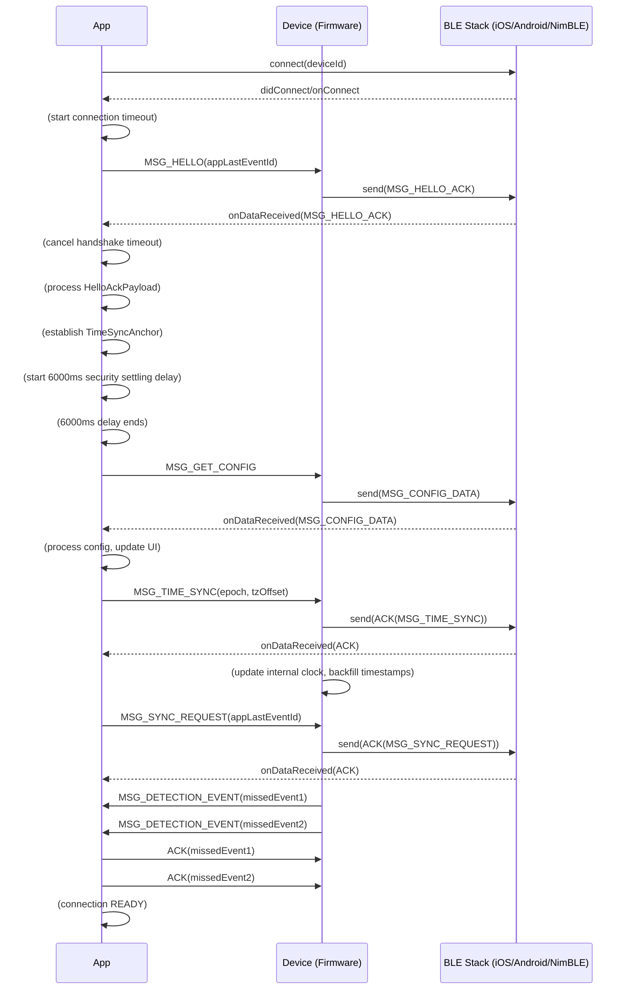
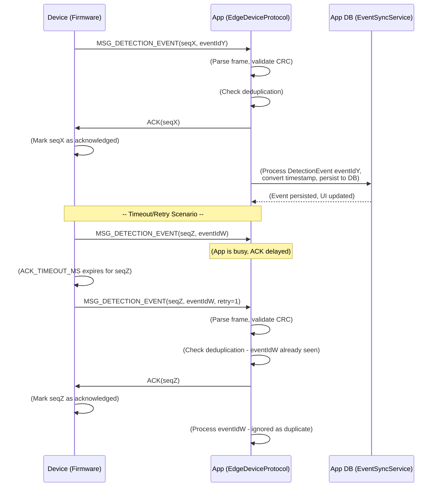

## 1. Overview

### 1.1. Purpose

This document serves as the authoritative specification for the **application-layer binary BLE protocol**. It precisely defines the communication contract between the ESP32-S3 firmware and the mobile application, ensuring cross-platform consistency, data integrity, and robust operational behavior.

### 1.2. Scope

This document covers:
*   The application-layer binary protocol framing and messaging, built on top of BLE GATT.
*   Exact frame formats, payload structures, and endianness rules for all defined messages.
*   The semantics and behavior of all message types (`MessageType` enum).
*   The reliability mechanisms (CRC, sequence numbers, ACK/NACK, retries, flow control).
*   Core communication flows, including initial handshake, reliable event delivery, time synchronization, configuration management, and OTA updates.
*   Compatibility rules and versioning strategy.
*   Considerations for iOS-specific BLE behaviors and background operation.

### 1.3. Audience

*   **Firmware Engineers**: To understand expected message formats, state transitions, and error handling for correct device-side implementation.
*   **Mobile Engineers**: To correctly build, parse, and interpret BLE messages, and to understand how protocol events map to app logic.
*   **Technical Reviewers/Architects**: To evaluate the system's communication design, reliability, and security properties.


### 1.4. Key Responsibilities

This protocol is responsible for:
*   Ensuring data integrity (`CRC16`) and ordered delivery (`SequenceNumber`).
*   Providing explicit feedback on message processing (`ACK`/`NACK`).
*   Managing communication flows that span multiple BLE transactions (e.g., handshake, OTA).
*   Throttling device-generated events to prevent network saturation (`Panic Governor`).
*   Establishing a common understanding for critical device data (`DetectionEvent`, `HelloAckPayload`, device settings).

## 2. Design Goals

The BLE protocol is intentionally designed to address limitations of raw BLE GATT and ensure a production-ready user experience.

*   **Reliability and Integrity**: BLE GATT characteristics themselves do not guarantee ordered or lossless delivery. This protocol adds application-layer mechanisms (CRC16, sequence numbers, ACK/NACK, retries) to ensure critical data arrives intact and in order, even over noisy or intermittent links.
*   **Efficiency and Boundedness**: Using a compact binary format minimizes over-the-air payload size. Fixed-size structures (`pragma pack(1)`) and known maximums (`PROTOCOL_MAX_PAYLOAD_SIZE`) bound memory usage on the constrained embedded device. `WRITE_NR` (Write Without Response) is favored for speed when application-level ACKs are sufficient.
*   **Cross-Stack Consistency**: The protocol acts as a precise contract. All message IDs, payload structures, and most critically, **endianness rules**, are explicitly defined and mirrored across firmware (`ProtocolDefs.h`) and mobile app (`protocol/types.ts`) to prevent subtle cross-platform bugs.
*   **iOS Platform Compatibility**: Recognizing specific iOS BLE behaviors (e.g., Resolvable Private Addresses (RPA), GATT cache invalidation, aggressive background suspension, bonding requirements), the protocol includes features and timings (e.g., IRK exchange, Database Hash, deferred connection parameters, graceful sleep handshakes) to ensure a stable and compliant iOS experience.
*   **Robustness and Recovery**: The system is designed for resilience. Mechanisms like the "Panic Governor" prevent self-induced denial-of-service, "Ghost Bond" detection addresses stale bonding keys, and comprehensive error codes (`ErrorCode`) facilitate specific recovery actions. Crash-resilient persistence for important state (`AsyncStorage` backups, `RTC_NOINIT_ATTR` counters) protects against data loss.

## 3. Protocol Architecture & System Context

The BLE protocol operates as an application layer on top of the Bluetooth Low Energy GATT transport. This layered approach allows for robust error handling and flow control that raw BLE GATT does not inherently provide.

*   **3.1.1. Mobile Application Layer (UI/React Native)**: Initiates commands, displays data, manages user interaction. It depends on `BluetoothHandler` for BLE access.
*   **3.1.2. App-side Protocol Services (EventSync, DeviceSettings)**: Orchestrate high-level logic (e.g., handshake, event persistence, configuration management). They consume and produce structured data via `EdgeDeviceProtocolService`.
*   **3.1.3. `EdgeDeviceProtocolService` (App)**: Implements the application-layer protocol logic (framing, ACK/NACK, retries). It uses a `BLESendFunction` to hand off raw byte arrays to the underlying BLE transport.
*   **3.1.4. BLE Transport Layer (Native Swift / React Native BleManager)**: Handles platform-specific BLE operations (scanning, connecting, GATT discovery, characteristic read/write/notify).
*   **3.1.5. BLE Host Stack (CoreBluetooth / NimBLE)**: The operating system's or embedded system's Bluetooth stack handles low-level GATT, L2CAP, and Link Layer operations.
*   **3.1.6. BLE Controller**: The hardware radio.
*   **3.1.7. `ProtocolHandler` (Firmware)**: The inverse of `EdgeDeviceProtocolService`, responsible for parsing incoming frames, validating integrity, and dispatching to appropriate `Device Services`.
*   **3.1.8. Device Services (Firmware)**: Implement the core functionality of the ESP32 (e.g., `Sensor_HAL`, `PowerManager`, `ConfigService`).

### 3.2. iOS Single BLE Stack Architecture

For iOS, a critical architectural decision is the use of a **native Swift module (`DeviceBLECore`)** that solely owns the `CBCentralManager` instance.

*   **Native Module Role**: The Swift module in `ios/CompanionApp/DeviceBLE/DeviceBLECore.swift` is the *only* component that creates and manages `CBCentralManager`. It handles scanning, connecting, GATT discovery, characteristic operations, and iOS background state restoration (`centralManager:willRestoreState`).
*   **`react-native-ble-plx` Bypass**: When `shouldUseNativeTransport()`  returns `true` (on iOS), the `BluetoothHandler` in `src/contexts/BluetoothContext.tsx` *does not* instantiate `BleManager` from `react-native-ble-plx`.
*   **Event Flow**: All BLE connection events, data reception, and errors from `DeviceBLECore.swift` are forwarded to the TypeScript `BluetoothHandler` via `RCTEventEmitter` callbacks (managed by `useDeviceBLEIntegration.ts`).
*   **Benefits**: This "single BLE stack" architecture on iOS prevents the "Dual BLE Manager" bug, where multiple `CBCentralManager` instances compete for control, causing unpredictable behavior and connection instability.

### 3.3. Android BLE Transport

On Android, if the native module is not linked or not intended for use, the `BluetoothHandler` in `src/contexts/BluetoothContext.tsx` directly instantiates and manages `BleManager` from `react-native-ble-plx`. All BLE operations are performed through this instance.

## 4. Frame Format: The On-Wire Contract

All application-layer communication adheres to a strict binary frame format to ensure efficient, integrity-checked message transfer.

### 4.1. Frame Layout Diagram

```
+--------+--------+--------+--------+--------+--------+--------+--------+
|  BYTE 0|  BYTE 1|  BYTE 2|  BYTE 3|  BYTE 4|  BYTE 5|  BYTE 6|   ...   |
+--------+--------+--------+--------+--------+--------+--------+--------+
|  SOF   |  Type  |  Ver   | SeqNum (MSB)    | SeqNum (LSB)    | Len (MSB) |
| (0xA5) |        | (0x01) | (Big-Endian)    | (Big-Endian)    | (Big-Endian) |
+--------+--------+--------+--------+--------+--------+--------+--------+
| Len (LSB) |                 Payload (Variable Length)                 |
| (Big-Endian) |                                                         |
+-------------+---------------------------------------------------------+
|   ...   | CRC16 (MSB)   | CRC16 (LSB)                                 |
|         | (Big-Endian)  | (Big-Endian)                                |
+---------+---------------+---------------------------------------------+
```

### 4.2. Field Descriptions (Table)

| Field Name | Size (Bytes) | Type | Endianness | Description |
| :--------- | :----------- | :--- | :--------- | :---------- |
| `SOF` | 1 | `uint8_t` | N/A | Start of Frame marker. Always `0xA5`. |
| `Type` | 1 | `uint8_t` | N/A | Message type, indicates payload content (See Appendix A). |
| `Version` | 1 | `uint8_t` | N/A | Protocol version. Current `0x01`. |
| `SequenceNumber` | 2 | `uint16_t` | Big-Endian | Monotonically increasing sequence number for ACKs and ordering. Wraps at `65535`. |
| `PayloadLength` | 2 | `uint16_t` | Big-Endian | Length of the `Payload` field in bytes (0 to `PROTOCOL_MAX_PAYLOAD_SIZE`). |
| `Payload` | Variable | `uint8_t[]` | Varies | Message-specific data (See Appendix C for details). Max `500` bytes. |
| `CRC16` | 2 | `uint16_t` | Big-Endian | CRC16-CCITT-FALSE checksum over `SOF` through `Payload`. |

### 4.3. Protocol Constants

These constants are defined in the firmware protocol definitions and mirrored in the app-side TypeScript types.

*   `PROTOCOL_SOF`: `0xA5`
*   `PROTOCOL_VERSION`: `0x01`
*   `PROTOCOL_HEADER_SIZE`: `7 bytes` (`SOF` + `Type` + `Version` + `SequenceNumber` + `PayloadLength`)
*   `PROTOCOL_CRC_SIZE`: `2 bytes`
*   `PROTOCOL_MAX_PAYLOAD_SIZE`: `500 bytes` (Actual BLE MTU limits effective payload to ~244 bytes)
*   `PROTOCOL_MIN_FRAME_SIZE`: `9 bytes` (`HEADER_SIZE` + `CRC_SIZE`)

## 5. Endianness and Payload Encoding Rules

Endianness is a critical aspect of cross-platform binary communication. The the protocol uses a mixed-endianness strategy, where header fields are Big-Endian (network byte order), but certain payloads are Little-Endian due to direct `reinterpret_cast` usage in firmware for `packed structs`.

### 5.1. General Endianness Principle

*   **Header Fields**: All fields within the standard frame header (`SequenceNumber`, `PayloadLength`, `CRC16`) are **Big-Endian (MSB first)**. This is a common practice for network protocols.
*   **Payloads**: Endianness for payload fields varies depending on how the firmware processes them.

### 5.2. Encoding Strategy by Serialization Method

| Serialization Method | Endianness | Applies To |
| :--- | :--- | :--- |
| **Frame header fields** | Big-Endian (MSB first) | `SequenceNumber`, `PayloadLength`, `CRC16` |
| **Packed struct payloads** (`reinterpret_cast`) | Little-Endian (ESP32-S3 native) | `DetectionEvent`, `HelloAckPayload`, `BatteryStatusPayload`, `TimeSyncPayload`, `DeviceStatusPayload` |
| **Manually serialized payloads** (byte-by-byte) | Big-Endian | `AckPayload`, `NackPayload`, `SyncRequestPayload`, `CalibrationResultPayload` |
| **Single-byte fields** | N/A | `ConfigDataPayload`, `SetConfigPayload` |

The mobile app parser explicitly handles this mixed-endianness conversion for each payload type.

### 5.3. Critical Endianness Invariants

*   The explicit endianness in app-side `BinaryProtocol.ts` is a direct reflection of firmware's serialization methods.
*   Any change to struct packing or byte-by-byte serialization in firmware *must* be immediately reflected in `BinaryProtocol.ts` and `protocol/types.ts`.
*   Failure to adhere to these rules will result in corrupted multi-byte values during cross-stack communication.

## 6. Message Taxonomy

The protocol defines various message types categorized by their function. A full reference table can be found in Appendix A.

### 6.1. Control and Handshake Messages

These messages manage the connection lifecycle and basic communication flow.
*   `MSG_HELLO` (0x00): Initiates communication after BLE connection. Includes `appLastEventId` for sync context.
*   `MSG_HELLO_ACK` (0x01): Device's response to `MSG_HELLO`, containing firmware version, device status, `lastEventId`, `currentMillis`, `configSignature`, and `hardwareId`.
*   `MSG_PING` (0x05): App's request to check device responsiveness.
*   `MSG_PONG` (0x06): Device's response to `MSG_PING`.
*   `MSG_SLEEP` (0x07): App's command to the device to enter deep sleep, or device's notification that it is entering deep sleep.

### 6.2. Acknowledgement and Error Signaling

These messages are fundamental to the protocol's reliability.
*   `MSG_ACK` (0x02): Positive acknowledgment for a received message.
*   `MSG_NACK` (0x03): Negative acknowledgment, indicating a message was rejected due to an error (`ErrorCode`).

### 6.3. Data and Event Transfer

Messages for transferring operational data and events.
*   `MSG_DETECTION_EVENT` (0x10): Device's notification of a detected interaction event. Contains `DetectionEvent` payload.
*   `MSG_BATTERY_STATUS` (0x11): Device's periodic update on battery level and charging status.
*   `MSG_DEVICE_STATUS` (0x12): Device's general status updates, e.g., Wi-Fi provisioning feedback (`DeviceStatusPayload`).
*   `MSG_SYNC_REQUEST` (0x13): App's request for historical (missed) `DETECTION_EVENT`s from the device.
*   `MSG_SYNC_DATA` (0x14): *Defined in firmware, but not used.* Firmware's `ProtocolHandler::handleSyncRequest()` sends individual `MSG_DETECTION_EVENT`s instead.

### 6.4. Configuration and Settings Management

Messages for reading and writing device settings.
*   `MSG_SET_CONFIG` (0x20): App's command to update a specific device setting (e.g., `sensitivity`).
*   `MSG_GET_CONFIG` (0x21): App's request for the device's current configuration.
*   `MSG_CONFIG_DATA` (0x22): Device's response to `MSG_GET_CONFIG`, containing current settings.
*   `MSG_CALIBRATE` (0x23): App's command to trigger a sensor recalibration on the device.

### 6.5. Time Synchronization

Messages for ensuring device time is accurate and consistent.
*   `MSG_TIME_SYNC` (0x24): App's command to synchronize the device's internal clock with the phone's time.
*   `MSG_SET_WIFI` (0x26): App's command to provision Wi-Fi credentials to the device, enabling NTP time synchronization.

### 6.6. OTA and Maintenance Messages

Messages related to firmware updates and device maintenance.
*   `MSG_ENTER_OTA_MODE` (0x38): App's command for the device to reboot into a dedicated Wi-Fi Flasher Mode for firmware updates.
*   `MSG_PAIRING_MODE` (0x43): App's command to put the device into pairing mode (e.g., to accept new bonds).
*   `MSG_CLEAR_BONDS` (0x44): App's command for the device to delete all stored BLE bonding keys.
*   *Note: Messages `0x30` to `0x37` (`MSG_OTA_INFO` to `MSG_OTA_STATUS`) are defined in `ProtocolDefs.h` but are largely superseded for actual firmware data transfer by the Wi-Fi-based Flasher Mode (triggered by `MSG_ENTER_OTA_MODE`). They may be used for initial negotiation but not bulk data.*

## 7. Core Protocol Flows

This section illustrates the typical sequences of messages for key operational scenarios, ensuring mutual understanding between the app and device.

### 7.1. Initial Handshake (`HELLO` → `HELLO_ACK`)

The handshake establishes a secure, synchronized communication channel after a BLE connection.

#### 7.1.1. Flow Description

1.  **BLE Connection**: The app (or iOS/Android native stack) establishes a secure BLE connection (bonding/encryption).
2.  **`MSG_HELLO` (App → Device)**: The app sends `MSG_HELLO` including its `lastEventId` (the ID of the last `DetectionEvent` it successfully processed). This is crucial for `Event ID Synchronization` (Section 9.6).
3.  **`MSG_HELLO_ACK` (Device → App)**: The device responds with `MSG_HELLO_ACK`. This payload (`HelloAckPayload`) includes vital device information:
    *   `firmwareMajor.Minor.Patch`: Device's firmware version.
    *   `lastEventId`: The last `DetectionEvent` ID the device has recorded.
    *   `currentMillis`: Device's uptime (`HAL::getSystemUptime()`) at the time of sending, used to establish the `TimeSyncAnchor`.
    *   `configSignature`: A random ID generated on device factory reset.
    *   `hardwareId`: The ESP32's permanent MAC address.
    *   `batteryPercent`, `isCharging`, `bondedDevices`, `sensitivity`.
4.  **Security Settling Delay (App)**: After receiving `HELLO_ACK`, the app waits for a `6000ms` delay. This critical delay allows the BLE security negotiation (encryption) to stabilize fully, preventing race conditions where the app sends subsequent commands (e.g., `GET_CONFIG`) over an unencrypted link, leading to immediate disconnection.
5.  **Settings Synchronization (App → Device)**: The app (`DeviceSettingsService`) then sends `MSG_GET_CONFIG` to retrieve the device's current settings.
6.  **Time Synchronization (App → Device)**: The app sends `MSG_TIME_SYNC` with its current epoch time and timezone offset to synchronize the device's clock.
7.  **Event Synchronization (App → Device)**: If `helloAck.lastEventId` is greater than the app's `lastEventId`, the app sends `MSG_SYNC_REQUEST` to fetch any missed `DetectionEvent`s.

#### 7.1.2. Sequence Diagram (Initial Handshake)



### 7.2. Reliable Event Delivery (`DETECTION_EVENT` → `ACK`)

The protocol ensures that `DetectionEvent`s are reliably transferred from the device to the app, even over unstable connections.

#### 7.2.1. Flow Description

1.  **Device Detects Hit**: The device detects a `DetectionEvent` via its sensor.
2.  **Device Sends `MSG_DETECTION_EVENT`**: The device encapsulates the `DetectionEvent` data into a protocol frame with a unique `SequenceNumber` and `CRC16`, then sends it to the app. This message **requires an ACK**.
3.  **App Receives Frame**: The app's `EdgeDeviceProtocolService` receives the raw data, buffers it, and parses the complete frame.
4.  **App Validates CRC**: The app verifies the `CRC16` of the frame.
    *   **If `CRC16` invalid**: App sends `MSG_NACK` with `ERR_CRC_MISMATCH` and discards the frame.
    *   **If `CRC16` valid**: App extracts the `DetectionEvent` payload.
5.  **App Sends `ACK`**: The app immediately sends `MSG_ACK` for the `DetectionEvent`'s `SequenceNumber`. This is a **critical step** that must occur *before* heavy app-side processing begins, to prevent firmware timeouts.
6.  **App Processes Event**: After sending the `ACK`, the app processes the `DetectionEvent`:
    *   Deduplicates the event using `eventId`.
    *   Converts the device's `timestampMs` to an absolute `Date` using the `TimeSyncAnchor` (or uses the device's `timestamp` epoch directly if available).
    *   Dispatches the event to registered callbacks (`onProcessedDetectionEvent`) for database persistence and UI updates.
7.  **Device Confirms `ACK`**: The device receives the `ACK` and removes the `MSG_DETECTION_EVENT` from its pending messages queue.
    *   **If `ACK` not received within `ACK_TIMEOUT_MS`**: The device retries sending the `MSG_DETECTION_EVENT` up to `MAX_RETRY_COUNT` times with exponential backoff.
    *   **If `MAX_RETRY_COUNT` exhausted**: The device gives up on transmitting the event, but the event remains in its local history for future sync attempts.

#### 7.2.2. Sequence Diagram (Reliable Event Delivery)



### 7.3. Time Synchronization (`TIME_SYNC` → `ACK`)

Ensures the device's internal clock is synchronized with the app's absolute time, enabling accurate timestamping of offline events.

#### 7.3.1. Flow Description

1.  **App Readiness**: After the initial handshake (`HELLO`/`HELLO_ACK`) is complete, the app has established a `TimeSyncAnchor` (recording `phoneEpochMs` and `deviceMillis` from `HELLO_ACK`).
2.  **App Sends `MSG_TIME_SYNC`**: The app sends `MSG_TIME_SYNC` with its current Unix epoch time (in seconds) and local timezone offset (in minutes).
3.  **Device Receives `MSG_TIME_SYNC`**: The device (`ProtocolHandler`) receives the message.
4.  **Device Updates Clock**: The device (`HistoryService::applyTimeSync()`) immediately updates its internal system clock (`settimeofday()`) to the provided epoch. This ensures all *future* events get accurate absolute timestamps.
5.  **Device Backfills Timestamps**: Crucially, the device then iterates through all `DetectionEvent`s in its internal ring buffer that belong to the *current boot session* and still have `timestamp == 0` (meaning they were logged offline without a valid time source). For these events, it calculates their absolute epoch time using the formula: `eventEpoch = currentEpoch - (currentUptime - eventUptime)/1000`. This is then written back into the `event.timestamp` field.
6.  **Device Persists Timestamps**: The device queues an NVS flush to persist these backfilled timestamps and the new `lastKnownEpoch` (in `UserConfig`) to non-volatile storage.
7.  **Device Sends `ACK`**: The device sends `MSG_ACK` to acknowledge receipt and processing of the `TIME_SYNC` command.

#### 7.3.2. Offline Timestamp Backfilling

*   **Problem**: The ESP32's `millis()` counter resets on every wake from deep sleep. Without a time reference, detections logged offline (especially across sleep cycles) have timestamps relative to their specific boot, leading to a "floating timeline" that cannot be merged with real-world time.
*   **Solution**: The `TimeSyncAnchor` (established during `HELLO_ACK`) provides a reference point. When `MSG_TIME_SYNC` is received:
    1.  The device's internal clock is set to the provided `epochSeconds`.
    2.  For any `DetectionEvent` logged during the *current boot session* (identified by `event.bootCount == device.bootCount`) that has `event.timestamp == 0`:
        *   Its precise `event.timestampMs` (uptime, which persists across deep sleep via RTC) is used.
        *   `event.timestamp` is calculated as `(currentPhoneEpoch - (currentDeviceUptime - event.timestampMs) / 1000)`.
*   **Result**: Offline detections are retroactively given accurate absolute timestamps, enabling the app to display a consistent timeline for all events.

### 7.4. Configuration Update (`SET_CONFIG` → `ACK` → `CONFIG_DATA`)

The app can update device settings, such as sensor sensitivity, with UI responsiveness and backend consistency.

#### 7.4.1. Flow Description

1.  **App User Action**: User adjusts a setting (e.g., sensitivity slider).
2.  **App Debounce**: The app (`DeviceSettingsService`) debounces rapid changes (e.g., during slider drag) to avoid flooding the BLE channel. A `500ms` delay (configurable `DEBOUNCE_DELAY_MS`) is used.
3.  **App Optimistic UI Update**: The UI is updated immediately for responsiveness, reflecting the new setting locally.
4.  **App Sends `MSG_SET_CONFIG`**: After the debounce, the app sends `MSG_SET_CONFIG` containing the `configId` (e.g., `ConfigId.SENSITIVITY`) and `value`. This message **requires an ACK**.
5.  **Device Receives `MSG_SET_CONFIG`**: The device (`ProtocolHandler`) receives the message.
6.  **Device Applies Setting**: The device (`ConfigService`) applies the new setting (e.g., updates `_userSensitivity` in `Sensor_HAL`), recalculating thresholds immediately.
7.  **Device Sends `ACK`**: The device sends `MSG_ACK` for the `MSG_SET_CONFIG`'s `SequenceNumber`.
8.  **App Confirms `ACK`**: The app receives the `ACK`, confirming the setting was applied.
    *   **If `ACK` fails (timeout/NACK)**: The app rolls back the UI to the `previousSensitivity` (`Optimistic UI Rollback`) and logs an error.
9.  **Device Sends `MSG_CONFIG_DATA`**: After applying and ACKing, the device sends `MSG_CONFIG_DATA` with the *current* device settings (which now include the newly applied value).
10. **App Updates Local Cache**: The app (`DeviceSettingsService`) receives `MSG_CONFIG_DATA`, updates its local cache, and notifies UI listeners.

### 7.5. Device Sleep Coordination (`MSG_SLEEP`)

The protocol supports graceful device-initiated sleep to optimize battery life while maintaining a good user experience.

#### 7.5.1. Flow Description

1.  **Device Idle Timeout**: If the device is connected but detects no meaningful user activity (detections, config changes) for `CONNECTED_IDLE_TIMEOUT_MS` (60 seconds), it initiates a sleep sequence.
2.  **Device Enters `SLEEP_PREP`**: The device transitions to a `SLEEP_PREP` state (e.g., fast red LED blink) for `SLEEP_PREP_TIME_MS` (5 seconds).
3.  **Device Sends `MSG_SLEEP`**: During `SLEEP_PREP`, the device sends `MSG_SLEEP` to the app. This message **does NOT require an ACK** as the device is shutting down.
4.  **App Receives `MSG_SLEEP`**: The app (`EdgeDeviceProtocolService::onDeviceSleep()`) receives the notification.
5.  **App Handles Gracefully**: The app sets an `isSleepDisconnect` flag (`BluetoothHandler`) to indicate an *expected disconnect*. This prevents:
    *   Triggering error alerts or circuit breakers.
    *   Counting as connection instability.
    *   The app will clean up its state and start auto-reconnection.
6.  **Device Disconnects BLE**: The device performs its pre-sleep cleanup (flushing NVS, stopping services, preparing GPIOs), then explicitly disconnects BLE.
7.  **Device Enters Deep Sleep**: The device finally enters deep sleep.
8.  **App Registers Auto-Reconnect**: With `isSleepDisconnect` set, `BluetoothHandler` will treat the ensuing `BleError.DeviceDisconnected` gracefully, cleaning up and immediately initiating auto-reconnection attempts.
9.  **Device Wakes & Advertises**: On a wake event (sensor, button, timer), the device starts advertising, allowing the app to seamlessly re-establish connection.

### 7.6. Bilateral Bond Clearing (`CLEAR_BONDS` → `ACK`)

Addresses the "Ghost Bond" problem where iOS forgets a device's bonding keys, but the ESP32 retains a stale bond record. This leads to insecure unencrypted connections or connection failures.

#### 7.6.1. Flow Description

1.  **User Initiates "Forget Device" (App)**: When the user requests to remove a device from the app.
2.  **App Sends `MSG_CLEAR_BONDS` (App → Device)**: The app sends `MSG_CLEAR_BONDS` to the device. This message **requires an ACK**.
3.  **Device Receives `MSG_CLEAR_BONDS`**: The device (`ProtocolHandler::handleClearBonds()`) receives the message.
4.  **Device Clears Bonds**: The device immediately calls `NimBLEDevice::deleteAllBonds()` to remove all stored bonding keys (IRK, LTK, etc.) from its NVS storage.
5.  **Device Sends `ACK`**: The device sends `MSG_ACK` to confirm that its bond storage has been cleared.
6.  **App Receives `ACK`**: The app receives the `ACK`.
7.  **App Clears Local State**: The app removes all local data related to the device (UUIDs, settings, failure counters).
8.  **User Guidance**: The app instructs the user to *manually "Forget This Device"* in iOS Settings → Bluetooth to complete the bilateral bond removal at the OS level.
9.  **Fresh Pairing**: The device is now in a clean state, ready for a fresh pairing process, where new bonding keys will be exchanged.

## 8. Reliability Model: Ensuring Data Integrity and Delivery

The the protocol integrates several mechanisms to provide a robust and reliable communication channel over BLE.

### 8.1. CRC16-CCITT-FALSE Integrity

*   **Mechanism**: A 16-bit CRC checksum (polynomial `0x1021`, initial `0xFFFF`, no reflection/XOR output) is calculated over the entire frame header and payload. The calculated CRC is appended as the last two bytes of the frame.
*   **Validation**: Upon reception, the app recalculates the CRC over the received header+payload and compares it to the received `CRC16`. If they mismatch, the frame is deemed corrupt and is NACKed.
*   Both firmware and app implement identical CRC16-CCITT-FALSE calculators.

### 8.2. Sequence Numbering (`uint16_t`)

*   **Mechanism**: Every outgoing message that requires an ACK is assigned a `SequenceNumber` (`uint16_t`) from a monotonically increasing counter. The counter wraps around at 65535.
*   **Purpose**:
    *   **ACK Matching**: Allows the sender to match incoming `ACK`s to the correct `PendingMessage`.
    *   **Duplicate Detection**: Allows the receiver to detect and discard duplicate messages.
    *   **Ordering**: Helps infer message order, though BLE's link layer provides some ordering guarantees.
*   Both firmware and app maintain independent monotonic sequence counters.

### 8.3. ACK/NACK Mechanism

*   **Mechanism**: Critical messages (e.g., `MSG_DETECTION_EVENT`, `MSG_SET_CONFIG`, `MSG_TIME_SYNC`) require an explicit acknowledgment.
    *   **`MSG_ACK`**: Sent by the receiver upon successful parsing and initial processing of a message. It contains the `SequenceNumber` of the acknowledged message.
    *   **`MSG_NACK`**: Sent by the receiver when a message is parsed but rejected due to an error (e.g., `ERR_INVALID_PAYLOAD`, `ERR_UNKNOWN_MSG`). It contains the `SequenceNumber` and an `ErrorCode`.
*   **Non-Acknowledged Messages**: Messages like `MSG_HEARTBEAT`, `MSG_HELLO_ACK`, `MSG_BATTERY_STATUS`, `MSG_CONFIG_DATA`, `MSG_DEVICE_STATUS`, `MSG_SLEEP` do NOT require an ACK. These are typically notifications or responses where application-layer reliability is handled by other means or is not critical.
*   **Phantom ACK Protection**: The firmware implements a counter (`_invalidAckCount`). If too many `ACK`s are received for unknown `SequenceNumber`s, it logs a warning but *no longer disconnects or clears the queue* (a critical fix in firmware to prevent "Ghost Retry" death loops).

### 8.4. Retry Logic and Timeouts

*   **Mechanism**: If an `ACK` is not received for a `PendingMessage` within a defined `ackTimeoutMs`, the message is retransmitted.
*   **Parameters**:
    *   `PROTOCOL_ACK_TIMEOUT_MS`: `6000ms` (`Config.h::Timing::ACK_TIMEOUT_MS`) on both app and firmware. This extended timeout is critical for iOS background compatibility.
    *   `PROTOCOL_MAX_RETRIES`: `3` attempts (`Config.h::Timing::MAX_RETRY_COUNT`).
    *   `PROTOCOL_RETRY_INTERVAL_MS`: `1000ms` (`ble.ts`). App uses exponential backoff (`delayMs * 2`).
*   **Failure**: If `MAX_RETRY_COUNT` is exhausted, the message is dropped from the pending queue, and an error is logged. For `MSG_DETECTION_EVENT`s, data remains on device for future sync.
*   **`BLE_NOT_CONNECTED` Fail-Fast**: If the underlying BLE transport signals `BLE_NOT_CONNECTED` during a send attempt or retry, all pending messages are immediately rejected, and the retry timer is stopped.

### 8.5. Duplicate and Out-of-Order Handling

*   **Mechanism**:
    *   **Deduplication**: The app (`EdgeDeviceProtocolService`) maintains a `Set` (`processedEventIds`) of recently processed `eventId`s (from `DetectionEvent`). Incoming `DetectionEvent`s are discarded if their `eventId` is already in the set. `eventIdOrder` ensures FIFO eviction.
    *   **Ordering**: `SequenceNumber`s aid in ordering. While BLE's link layer helps, application-layer sequencing adds robustness. The `MSG_DETECTION_EVENT` deduplication handles any cases where out-of-order packets lead to re-delivery of old data.
*   **Window Size**: `MAX_DEDUPLICATION_EVENTS` (100) events are tracked for deduplication.

### 8.6. Heartbeat and Liveness Monitoring

*   **Mechanism**: Both app and firmware send `MSG_HEARTBEAT` periodically (every `BLE_HEARTBEAT_INTERVAL_MS` = `5000ms`). These messages **do NOT require an ACK**.
*   **Purpose**: To keep the BLE connection alive and confirm device responsiveness. iOS may suspend background apps or terminate inactive BLE connections if no data is flowing.
*   **Firmware Timeout**: The device has a `HEARTBEAT_TIMEOUT_MS` (2 hours) for non-bonded connections. If no heartbeat is received from the app, the device enters sleep.
*   **App Health Check**: The app (`BluetoothHandler::verifyConnectionHealth()`) actively sends `HEARTBEAT`s and expects the BLE link to remain active. It is security-aware, ignoring security errors during the early phase to prevent unintended disconnects.

### 8.7. Panic Governor / Flow Control

*   **Mechanism**: The firmware's `ProtocolHandler` implements a "Panic Governor" to rate-limit `MSG_DETECTION_EVENT`s. If the device detects more than `MAX_DETECTIONS_PER_WINDOW` (5) `DETECTION_EVENT`s within `DETECTION_RATE_WINDOW_MS` (1000ms), excess events are **dropped** (not queued).
*   **Purpose**: To prevent the device from overwhelming the BLE channel when sensor sensitivity is misconfigured (e.g., continuous false positives). This preserves the RX bandwidth, allowing `MSG_SET_CONFIG` (to fix sensitivity) to pass through.
*   **Mitigation**: When the Panic Governor activates, the firmware also tells `Sensor_HAL` to `suppressDetections()` for 1 second, conserving CPU cycles.
*   **Data Loss**: Dropped `DETECTION_EVENT`s are *not* permanently lost; they remain in the device's history and can be recovered via `MSG_SYNC_REQUEST` on the next connection. This prioritizes system stability over immediate delivery of all events.

## 9. Protocol Lifecycle and Mobile OS Considerations

The protocol's state management closely interacts with the underlying BLE connection lifecycle and is heavily influenced by mobile operating system behaviors, particularly iOS.

### 9.1. App-side Connection State Machine

The app's `BluetoothHandler` maintains an explicit connection state machine (`ConnectionState`) to track the BLE connection lifecycle:
*   `DISCONNECTED`: No active connection.
*   `CONNECTING`: Attempting to establish a physical BLE link.
*   `CONNECTED`: Physical BLE link established, but GATT services/characteristics not yet discovered.
*   `HANDSHAKING`: GATT services discovered, characteristic notifications subscribed, and application-layer handshake (`HELLO` → `HELLO_ACK` → `TIME_SYNC` → `GET_CONFIG`) is in progress.
*   `READY`: Fully connected, subscribed, and application-layer handshake complete. Data can flow reliably.
*   `DISCONNECTING`: Actively tearing down a connection (e.g., user-initiated disconnect).

### 9.2. Handshake Readiness (`HANDSHAKING` → `READY`)

*   **Critical Delay**: After `MSG_HELLO_ACK`, the app introduces a `6000ms` delay before proceeding with subsequent commands (`MSG_GET_CONFIG`, `MSG_TIME_SYNC`). This is crucial to allow iOS/Android BLE security negotiations (encryption, bonding) to fully stabilize. Without this delay, `MSG_GET_CONFIG` could be rejected on an unencrypted link, leading to connection drops.
*   **Handshake Timeout (`HANDSHAKE_TIMEOUT_MS`)**: If the entire handshake flow (from `CONNECTING` to `READY`) does not complete within `HANDSHAKE_TIMEOUT_MS` (30 seconds), the app (`BluetoothHandler`) tears down the connection and attempts to reconnect.
*   **Background Behavior**: If the app enters the background during the handshake, timeouts are *ignored*, and the handshake is allowed to continue in the background when iOS provides execution time. This prevents reconnect loops.
*   **Safety Net**: After `MAX_CONSECUTIVE_HANDSHAKE_FAILURES` (3) consecutive handshake failures for a device, the app (`BluetoothHandler`) assumes a corrupted device state and automatically "forgets" the device (`handleBondingError`) to force a fresh pairing.

### 9.3. iOS Background Execution and State Restoration

*   **`bluetooth-central` Mode**: The app declares `bluetooth-central` in its `Info.plist`, allowing iOS to maintain BLE connections even when the app is suspended or killed.
*   **`willRestoreState` (`CBCentralManagerDelegate`)**: Implemented in `ios/CompanionApp/DeviceBLE/DeviceBLECore.swift` and initiated by `AppDelegate`. This allows iOS to relaunch the app in the background and restore the BLE session if a connection was active. The restoration process is *idempotent*, always driving the full GATT pipeline (discover → subscribe) to ensure a fully `READY` state.
*   **Keychain Accessibility**: To ensure BLE background operations (like auto-reconnection or processing `HelloAckPayload` for `hardwareId`) can access `SecureStore` (which relies on Keychain), critical data is stored with `keychainAccessible: SecureStore.AFTER_FIRST_UNLOCK`. This allows access even when the screen is locked or the app is backgrounded.
*   **Background Health Checks**: `BluetoothHandler` continues sending periodic `MSG_HEARTBEAT`s (`BLE_HEARTBEAT_INTERVAL_MS`) even when the app is backgrounded to prevent iOS from timing out and terminating the BLE connection.

### 9.4. iOS Resolvable Private Addresses (RPA) Handling

*   **Problem**: iOS devices periodically change their MAC address (RPA) for privacy. If the app tries to reconnect using an old MAC, the connection might appear as a "new" device.
*   **Solution**:
    1.  **IRK Exchange**: Firmware (NimBLE) is configured to exchange Identity Resolving Keys (IRK) during bonding (`CONFIG_BT_NIMBLE_SM_SC=1`, `BLE_SM_PAIR_KEY_DIST_ID`). This allows the device to resolve RPAs to the bonded identity.
    2.  **`HelloAckPayload::hardwareId`**: The device explicitly sends its permanent hardware MAC address (`ESP_MAC_BT`) in `MSG_HELLO_ACK`. The app uses this as the stable device identifier, not the volatile BLE peripheral UUID.
    3.  **Deferred Security Initiation**: In `BLEManager.cpp`, `startSecurity()` is called *conditionally* (only if no bonds exist) or deferred to `onAuthenticationComplete` (if bonds exist) to allow iOS's native IRK resolution to complete. This prevents the device from prematurely initiating new pairing attempts.

### 9.5. GATT Attribute Cache Invalidation

*   **Problem**: iOS aggressively caches GATT service and characteristic discovery. After a firmware update, if the GATT database changes, iOS might use stale cached information, leading to communication errors.
*   **Solution**: The device implements the `Generic Attribute Service (0x1801)` with:
    1.  **`Service Changed (0x2A05)` Characteristic**: The device sends an indication on this characteristic to notify iOS of a GATT database change.
    2.  **`Database Hash (0x2B2A)` Characteristic**: A 16-byte hash (derived from firmware version and GATT structure) is provided. iOS can read this to detect changes and invalidate its cache.
*   The firmware updates this hash whenever the GATT structure changes.

### 9.6. Event ID Synchronization

*   **Problem**: If the device's firmware is reset/reflashed, its `globalEventId` (for `DetectionEvent`s) resets to 0. The app might have a much higher `lastEventId` from previous sessions. New device events would be rejected by the app as "old."
*   **Solution**: During the `HELLO` handshake:
    1.  The app sends its `lastEventId` in the `MSG_HELLO` payload.
    2.  The device receives this. If the app's `lastEventId` is *higher* than the device's `globalEventId`, the device (`HistoryService::fastForwardEventId()`) increments its `globalEventId` to match the app's.
    3.  This synchronized ID is immediately persisted to NVS to survive power loss.
*   **Result**: The next `DetectionEvent` generated by the device will have an `eventId` that the app accepts, preventing data rejection.

## 10. Error Handling and Failure Modes

The protocol explicitly defines error codes and handling strategies to ensure robustness and facilitate debugging.

*   **10.1. Error Code Reference**: Refer to Appendix B for a full list of `ErrorCode` values.
*   **10.2. Frame Parsing Errors**:
    *   **CRC Mismatch (`ERR_CRC_MISMATCH`)**: If `calculateCRC16` does not match `receivedCrc`, the app sends `MSG_NACK` with `ERR_CRC_MISMATCH` and discards the frame.
    *   **Unknown Message Type (`ERR_UNKNOWN_MSG`)**: If `frame.type` is not recognized, the app sends `MSG_NACK` with `ERR_UNKNOWN_MSG`.
    *   **Invalid Payload Length (`ERR_INVALID_LENGTH`)**: If `frame.payload.length` does not match the expected size for `frame.type`, the app sends `MSG_NACK` with `ERR_INVALID_PAYLOAD` (a more generic code for payload content validation).
    *   **Unsupported Version**: If `frame.version` does not match `PROTOCOL_VERSION`, the app discards the frame without NACKing (assuming device will not understand NACK).
    *   **Receive Buffer Overflow**: If the `receiveBuffer` exceeds `MAX_RECEIVE_BUFFER_SIZE` (1024 bytes) without forming a valid frame, the app logs a critical error, clears the buffer, and notifies via `onBufferOverflow`. This indicates stream corruption.
*   **10.3. NACK Processing**: When the app receives a `MSG_NACK`, it immediately rejects the corresponding pending message, stopping any retries.
*   **10.4. Timeout and Retry Exhaustion**: If a message requiring ACK is not acknowledged after `PROTOCOL_MAX_RETRIES` (3) attempts within `PROTOCOL_ACK_TIMEOUT_MS` (6000ms), the app logs an error, rejects the pending promise, and removes the message from the queue.
*   **10.5. Connection Loss and Auto-Reconnection**:
    *   **Silent Disconnection**: The app's `BluetoothHandler::handleSilentDisconnection()` detects when a BLE connection is lost without a formal `didDisconnectPeripheral` callback (e.g., due to OS termination or `BleError`). It cleans up state and initiates auto-reconnection with exponential backoff.
    *   **Dormant Reconnection**: After `MAX_RECONNECT_ATTEMPTS` (5) aggressive reconnects fail, the app enters a "dormant" mode, retrying every `DORMANT_RECONNECTION_INTERVAL_MS` (60 seconds) indefinitely, leveraging native `autoConnect` for persistence.
*   **10.6. GATT Pipeline Faults**: The native BLE module (`DeviceBLECore.swift`) categorizes specific GATT errors (e.g., `serviceNotFound`, `characteristicNotFound`, `subscriptionFailed`, `discoveryTimeout`, `subscriptionTimeout`) and emits explicit `DisconnectReason` events (`onConnectionStateChange`) before disconnecting. This allows the app to distinguish firmware configuration errors from general RF issues.
*   **10.7. Handshake Failure Safety Net**: After `MAX_CONSECUTIVE_HANDSHAKE_FAILURES` (3) consecutive handshake failures (e.g., `MSG_HELLO_ACK` not received), the app (`BluetoothHandler`) assumes device state corruption and automatically "forgets" the device (`handleBondingError`) to force a fresh pairing.

## 11. Versioning and Compatibility

The protocol includes version fields to manage evolution and ensure compatibility between firmware and app.

*   **11.1. `PROTOCOL_VERSION` Field**: A single `uint8_t` in the frame header (`0x01`). This indicates the overall framing and messaging structure version. A change here implies a fundamental, potentially breaking, change to frame parsing.
*   **11.2. Firmware Version**: The firmware reports its `FIRMWARE_VERSION_MAJOR.MINOR.PATCH` and `FIRMWARE_BUILD_TYPE` in the `HelloAckPayload`. This allows the app to adapt to new features or display compatibility warnings.
*   **11.3. App Protocol Version**: The app sends its `PROTOCOL_VERSION` in the `MSG_HELLO` payload. This allows the firmware to detect app compatibility.
*   **11.4. Compatibility Policy**:
    *   **Backward Compatibility**: Firmware is generally designed to remain backward-compatible with older app versions, meaning old `MessageType`s and `Payload` structures are still parsed.
    *   **Forward Compatibility (App)**: The app attempts to gracefully handle newer firmware versions by ignoring unknown `MessageType`s or extra fields in `Payload` structures, if possible. Strict `static_assert` for struct sizes in firmware and app `types.ts` is crucial.
    *   **Schema Migration**: `ConfigService` on the firmware side handles version changes to `UserConfig` using schema migration logic.

## 12. OTA Workflow: Safe Recoverable Firmware Updates (Flasher Mode)

The firmware update process employs a robust, multi-stage protocol, leveraging both BLE and Wi-Fi to ensure safety, reliability, and recovery, especially on battery-constrained devices with no physical recovery button.

### 12.1. Overview and Rationale

*   **12.1.1. BLE-Triggered, Wi-Fi-Based (Not BLE Data Transfer)**: The entire OTA *data transfer* does **not** occur over BLE. BLE is only used as the trigger (`MSG_ENTER_OTA_MODE`) to command the device to enter a dedicated Wi-Fi Flasher Mode. The actual firmware image is then uploaded via HTTP over Wi-Fi. This separation addresses BLE's limitations for large data transfers (slow throughput, MTU fragmentation, high power consumption for continuous transfer) and allows for a more robust, fault-tolerant upload.
*   **12.1.2. Safety Features and Power-Cycle Recovery**:
    *   **Isolated Flasher Mode**: The device reboots into a minimal environment, disabling all high-power peripherals (BLE, sensors) to conserve battery during Wi-Fi operations.
    *   **2-Stage Power Gating**: Before Wi-Fi starts, and again under Wi-Fi load, battery voltage is checked to prevent brownouts during flash erase/write operations.
    *   **Health-Gated Boot Commit**: New firmware must pass `performSelfTest()` (checking sensor, heap, NVS, partitions) before being marked as valid.
    *   **Automatic Rollback**: If self-test fails, the bootloader automatically reverts to the previous working firmware partition.
    *   **Power-Cycle Recovery**: If the device becomes unbootable (bricked), power-cycling 3 times within 5 seconds forces it into Flasher Mode for recovery (`BootRecoveryTracker`).

### 12.2. Phase 1: Initiating Flasher Mode (BLE)

1.  **App Call**: The app calls `EdgeDeviceProtocolService::sendEnterOtaMode()`.
2.  **`MSG_ENTER_OTA_MODE` (App → Device)**: The app sends this message (`0x38`) to the device. This message **requires an ACK**.
3.  **Device Acknowledges**: The device (`ProtocolHandler::handleEnterOtaMode()`) receives the message and sends `MSG_ACK`.
4.  **Device Reboot**: After sending the ACK and a `200ms` delay (to ensure ACK transmission), the device sets an RTC boot mode flag (`g_boot_mode = MODE_FLASHER`) and performs a software restart (`esp_restart()`).
5.  **BLE Disconnection**: The BLE connection is lost as the device reboots.

### 12.3. Phase 2: Wi-Fi Connection

1.  **User Action**: The app guides the user to disconnect from BLE and connect their phone to a temporary Wi-Fi Access Point created by the device.
2.  **Device SoftAP**: The device, now in Flasher Mode, starts a Wi-Fi SoftAP:
    *   SSID: Configurable (set in `Config.h`)
    *   Password: Configurable (set in `Config.h`)
    *   IP Address: `192.168.4.1` (ESP32 SoftAP default)
3.  **App Connects**: The app establishes an HTTP connection to the device's IP.

### 12.4. Phase 3: Firmware Upload (HTTP)

This phase follows a **3-phase HTTP protocol** to decouple blocking flash operations from network transactions, improving reliability (`Explicit Erase Protocol`).

1.  **`POST /start` (Trigger Erase)**:
    *   **App Action**: The app (`OtaService::startSession()`) sends a `POST` request to `http://192.168.4.1/start`.
    *   **Headers**: `X-Session-ID` (unique ID), `X-Total-Size` (total firmware size).
    *   **Device Response**: The device responds with `200 OK` *immediately*.
    *   **Device Action**: The device (`FlasherService::run()`) then initiates the lengthy flash erase operation *in its main loop* (entering `ERASING` phase), outside the HTTP handler context.
2.  **`GET /status` (Poll for `RECEIVING` Phase)**:
    *   **App Action**: The app (`OtaService::waitForPhase()`) repeatedly polls `http://192.168.4.1/status`.
    *   **Purpose**: The app waits until the `FlasherStatus::phase` field changes from `ERASING` to `RECEIVING`, indicating the flash erase is complete. This prevents HTTP timeouts during the erase.
3.  **`POST /update_chunk` (Multipart Binary Upload)**:
    *   **App Action**: Once `phase=RECEIVING`, the app (`OtaService::uploadFirmware()`) sends the firmware in `CHUNK_SIZE` (4KB) segments via `POST` requests to `http://192.168.4.1/update_chunk`.
    *   **Encoding (`CRITICAL FIX`)**: Chunks are sent as `multipart/form-data` (built by `buildMultipartBody()`). This is critical because the ESP32 WebServer's upload handler *only* triggers for `multipart/form-data`, ensuring binary-safe handling of the firmware data.
    *   **Headers**: `Content-Type: multipart/form-data; boundary=...`, `Content-Length`, `X-Session-ID`, `X-Chunk-Index`, `X-Total-Chunks`, `X-Chunk-Size`.
    *   **Device Response**: The device responds with `200 OK` *immediately*.
    *   **Device Action**: The device writes the chunk to flash in its main loop.
    *   **Chunk Acknowledgment**: The app monitors `FlasherStatus::lastChunk` in `/status` to confirm each chunk is committed, waiting up to `CHUNK_ACK_TIMEOUT_MS` (8 seconds) before retrying the chunk.
    *   **Inter-Chunk Delay**: An `INTER_CHUNK_DELAY_MS` (15ms) is introduced between chunk uploads to allow the device's TCP stack to process ACKs and handle interrupts, preventing TCP window exhaustion.

### 12.5. Phase 4: Verification and Reboot

1.  **Device Validation**: After all chunks are received, the device performs final checks (total size, CRC32).
2.  **Device Reboots**: On successful verification, the device's bootloader marks the new firmware as the active partition and performs a software restart (`ESP.restart()`).

### 12.6. Phase 5: Post-Update Verification (BLE)

1.  **App Reconnects**: The app attempts to reconnect to the device over BLE (it will now be advertising the new firmware).
2.  **`OtaPostUpdateVerifier`**: The app's `OtaPostUpdateVerifier` waits for the BLE connection to establish and for the `MSG_HELLO_ACK` message.
3.  **Firmware Version Check**: The app extracts the `firmwareMajor.Minor.Patch` and `hardwareId` from the `HelloAckPayload`. It verifies that the reported firmware version matches the expected new version.
4.  **Local Device Update**: The app updates the local device record with the new firmware version.

### 12.7. OTA File-Based Logging (`ota_debug_log.txt`)

*   **Mechanism**: All OTA operations (readiness checks, upload progress, errors) are logged to a persistent text file: `ota_debug_log.txt` in the app's document directory.
*   **Purpose**: Provides comprehensive diagnostics for debugging OTA failures, especially in the field where real-time serial logs are unavailable. Logs include timestamps, log levels, messages, and associated data.
*   **Access**: Logs can be accessed via the iOS Files app or Android file browser, and through dedicated app UI if implemented.

### Appendix A — Message Type Reference

This table provides a comprehensive list of all defined `MessageType` IDs, their names, communication direction, and whether they require an application-layer acknowledgment.

| ID (Hex) | Enum Name | Direction | Acknowledged | Description |
| :------- | :-------- | :-------- | :----------- | :---------- |
| `0x00` | `MSG_HELLO` | App→Dev | Yes | Initial handshake, sync appLastEventId. |
| `0x01` | `MSG_HELLO_ACK` | Dev→App | No | Handshake response, device info. |
| `0x02` | `MSG_ACK` | Bidirectional | N/A | Positive acknowledgement. |
| `0x03` | `MSG_NACK` | Bidirectional | N/A | Negative acknowledgement with error. |
| `0x04` | `MSG_HEARTBEAT` | Bidirectional | No | Connection keep-alive. |
| `0x05` | `MSG_PING` | App→Dev | Yes | Health check request. |
| `0x06` | `MSG_PONG` | Dev→App | No | Health check response. |
| `0x07` | `MSG_SLEEP` | App→Dev / Dev→App | No | Request/notify sleep mode. |
| `0x10` | `MSG_DETECTION_EVENT` | Dev→App | Yes | Hit event data. |
| `0x11` | `MSG_BATTERY_STATUS` | Dev→App | No | Battery level and charging state. |
| `0x12` | `MSG_DEVICE_STATUS` | Dev→App | No | General device status (e.g., Wi-Fi provisioning feedback). |
| `0x13` | `MSG_SYNC_REQUEST` | App→Dev | Yes | Request missed events. |
| `0x14` | `MSG_SYNC_DATA` | Dev→App | No | *Defined, but not used. Firmware sends individual `MSG_DETECTION_EVENT`s instead.* |
| `0x20` | `MSG_SET_CONFIG` | App→Dev | Yes | Update device configuration. |
| `0x21` | `MSG_GET_CONFIG` | App→Dev | Yes | Request current configuration. |
| `0x22` | `MSG_CONFIG_DATA` | Dev→App | No | Configuration response. |
| `0x23` | `MSG_CALIBRATE` | App→Dev | Yes | Trigger sensor calibration. |
| `0x24` | `MSG_TIME_SYNC` | App→Dev | Yes | Time synchronization. |
| `0x25` | `MSG_SET_COLORS` | App→Dev | No | *Defined, but handler status unknown/not implemented in firmware.* |
| `0x26` | `MSG_SET_WIFI` | App→Dev | Yes | Set Wi-Fi credentials for NTP sync. |
| `0x30` | `MSG_OTA_INFO` | App→Dev | Yes | Request OTA info. |
| `0x31` | `MSG_OTA_INFO_RESP` | Dev→App | No | OTA info response. |
| `0x32` | `MSG_OTA_START` | App→Dev | Yes | Begin OTA transfer (BLE-based). *Superseded by Wi-Fi Flasher Mode for data.* |
| `0x33` | `MSG_OTA_DATA` | App→Dev | No | OTA data chunk (BLE-based). *Superseded by Wi-Fi Flasher Mode for data.* |
| `0x34` | `MSG_OTA_DATA_ACK` | Dev→App | No | Chunk received ACK (BLE-based). *Superseded by Wi-Fi Flasher Mode for data.* |
| `0x35` | `MSG_OTA_COMMIT` | App→Dev | Yes | Finalize OTA (BLE-based). *Superseded by Wi-Fi Flasher Mode for data.* |
| `0x36` | `MSG_OTA_ABORT` | Bidirectional | No | Abort OTA transfer. *Superseded by Wi-Fi Flasher Mode for data.* |
| `0x37` | `MSG_OTA_STATUS` | Dev→App | No | OTA progress/status (BLE-based). *Superseded by Wi-Fi Flasher Mode for data.* |
| `0x38` | `MSG_ENTER_OTA_MODE` | App→Dev | Yes | Reboot device into Wi-Fi Flasher Mode for OTA upload. |
| `0x40` | `MSG_LOG_REQUEST` | App→Dev | Yes | Request device logs. |
| `0x41` | `MSG_LOG_DATA` | Dev→App | No | Log entries response. |
| `0x42` | `MSG_FACTORY_RESET` | App→Dev | Yes | Reset device to factory defaults. |
| `0x43` | `MSG_PAIRING_MODE` | App→Dev | Yes | Enter pairing mode. |
| `0x44` | `MSG_CLEAR_BONDS` | App→Dev | Yes | Clear all stored BLE bonds on device. |

### Appendix B — Error Code Reference

Error codes returned in `MSG_NACK` messages, matching firmware `ErrorCode` enum.

| ID (Hex) | Enum Name | Description |
| :------- | :-------- | :---------- |
| `0x00` | `ERR_NONE` | No error. |
| `0x01` | `ERR_CRC_MISMATCH` | Frame CRC16 validation failed. |
| `0x02` | `ERR_SEQ_OUT_OF_ORDER` | Unexpected sequence number received. |
| `0x03` | `ERR_INVALID_LENGTH` | Payload length mismatch. |
| `0x04` | `ERR_UNKNOWN_MSG` | Unknown message type received. |
| `0x05` | `ERR_INVALID_STATE` | Message not valid in current device state. |
| `0x06` | `ERR_BUSY` | Device is busy (e.g., OTA in progress, CPU contention). |
| `0x07` | `ERR_FLASH_WRITE` | Internal flash write operation failed. |
| `0x08` | `ERR_LOW_BATTERY` | Battery level too low for requested operation. |
| `0x09` | `ERR_NOT_BONDED` | Security error: device not bonded or authentication failed. |
| `0x0A` | `ERR_INVALID_PAYLOAD` | Payload content invalid (e.g., malformed data). |
| `0x0B` | `ERR_TIMEOUT` | Operation timed out on device side. |
| `0x0C` | `ERR_OTA_FAILED` | OTA update process failed. |
| `0x0D` | `ERR_CALIBRATION` | Sensor calibration failed. |
| `0x0E` | `ERR_SENSOR` | Generic sensor hardware error. |
| `0xFF` | `ERR_INTERNAL` | Internal firmware error (unexpected bug). |

### Appendix C — Global BLE Constants

Key BLE constants shared between firmware and app.

*   **Service & Characteristic UUIDs**: `[REMOVED]`
*   **MTU**: `247` bytes.
*   **Connection Intervals**: `30–60ms`.
*   **Slave Latency**: `0` (optimized for high-throughput sync).
*   **Supervision Timeout**: `6s` (provides margin for JS thread blocking).
*   **TX Power**: `+9dBm`.
*   **Heartbeat Interval**: `5000ms`.
*   **ACK Timeout**: `6000ms`.
*   **Max Retries**: `3`.
*   **Handshake Timeout**: `30s`.
*   **Pairing Window**: `60s`.
